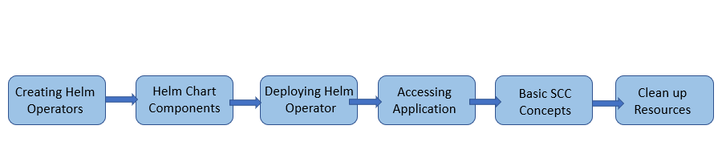

**What you'll learn in this lab!!**

In this lab, you will gain a basic understanding of Helm Operator, which includes:

1. Creating Helm based Operators using Operator-SDK 1 (operator-sdk version: "v1.1.0")

2. Understanding some basic components of Helm Chart.

3. Building Helm Operator using an existing Helm chart.

4. Deploying Helm Operator on Openshift Cluster.

5. Accessing the application using routes.

6. Understanding some basic concepts of SecurityContextConstraints (SCC).

7. Cleanup of Operator and Resources

