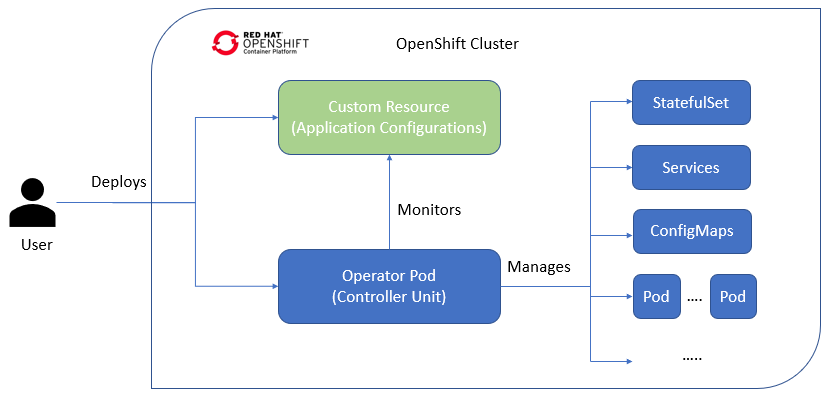

This guide outlines Helm chart support in the Operator SDK and walks Operator authors through an example of building and running Operator with the operator-sdk CLI tool that uses an existing Helm chart.

The Operator Framework is an open source toolkit to manage Kubernetes native applications, called Operators, in an effective, automated, and scalable way. This framework includes the Operator SDK, which assists developers in bootstrapping and building an Operator based on their expertise without requiring knowledge of Kubernetes API complexities.

One of the Operator SDK’s options for generating an Operator project includes leveraging an existing Helm chart to deploy Kubernetes resources as a unified application, without having to write any Go code. Such Helm-based Operators are designed to excel at applications that require very little logic when rolled out, because changes should be applied to the Kubernetes objects that are generated as part of the chart.


Architecture Diagram:



The main function of an Operator is to read from a custom object that represents your application instance and have its desired state match what is running. In the case of a Helm-based Operator, the object’s spec field is a list of configuration options that are typically described in Helm’s values.yaml file. Instead of setting these values with flags using the Helm CLI (for example, helm install -f values.yaml), you can express them within a Custom Resource (CR), which, as a native Kubernetes object, enables the benefits of RBAC applied to it and an audit trail.

For an example of a simple CR called Nginx:

```
apiVersion: apache.org/v1alpha1
kind: Nginx
metadata:
  name: example-app
spec:
  replicaCount: 2
```

The ```replicaCount``` value ```2``` is propagated into the chart’s templates where following is used:

```{{ .Values.replicaCount }}```

After an Operator is built and deployed, you can deploy a new instance of an app by creating a new instance of a CR, or list the different instances running in all environments using the oc command:

```$ oc get Nginx --all-namespaces```

There is no requirement use the Helm CLI or install Tiller; Helm-based Operators import code from the Helm project. All you have to do is have an instance of the Operator running and register the CR with a Custom Resource Definition (CRD). And because it obeys RBAC, you can more easily prevent production changes.

**Operator-SDK**

The Operator SDK is a framework designed to make writing operators easier by providing :

* High-level APIs and abstractions to write the operational logic more intuitively
* Tools for scaffolding and code generation to quickly bootstrap a new project.
* Extensions to cover common operator use cases.

The Operator-SDK creates the project skeleton which consists of the various directories alongwith some pre-written code so that the developer only needs to focus on the main logic. The SDK provides the following workflow to develop a new operator:

* Create a new Operator project using the SDK command line interface (CLI).
* Define new resource APIs by adding Custom Resource Definitions (CRDs).
* Specify resources to watch using the SDK API.
* Define the Operator reconciling logic in a designated handler and use the SDK API to interact with resources.
* Use the SDK CLI to build and generate the Operator deployment manifests.
