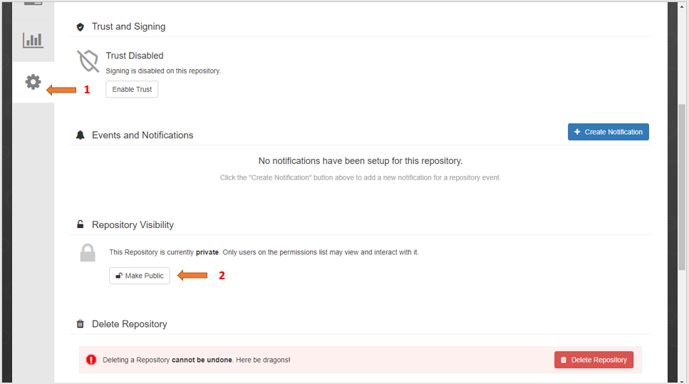

In this lab you are going to use <a href=https://quay.io target="_blank">Quay.io</a> for the image repository of our operator. If you don't already have a quay account, please register <a href=https://quay.io/signin/ target="_blank">here</a>

Execute below command and enter your username and password to login with your quay account:

```execute
docker login quay.io
```
Now that all your operator components are updated and your quay.io account is setup we can build the operator image and push to the quay.io repository.

To `Build` and `Push` the operator image, click on below command to get it in terminal and replace *<username>* with your quay user name, then execute it.

```copycommand
sudo make docker-build docker-push IMG=quay.io/<username>/mvc-db-app-operator:v0.0.1
```

After successfully completing build and push, the output will be something like this:

```
docker build . -t quay.io/<username>/mvc-db-app-operator:v0.0.1
Sending build context to Docker daemon  65.02kB
Step 1/5 : FROM quay.io/operator-framework/helm-operator:v1.1.0
 ---> 206e201b044c
Step 2/5 : ENV HOME=/opt/helm
 ---> Using cache
 ---> 8554bb389fda
Step 3/5 : COPY watches.yaml ${HOME}/watches.yaml
 ---> Using cache
 ---> 6bf5b6cf0f98
Step 4/5 : COPY helm-charts  ${HOME}/helm-charts
 ---> Using cache
 ---> e52720aff657
Step 5/5 : WORKDIR ${HOME}
 ---> Using cache
 ---> 42d45c504a59
Successfully built 42d45c504a59
Successfully tagged quay.io/<username>/mvc-db-app-operator:v0.0.1
docker push quay.io/<username>/mvc-db-app-operator:v0.0.1
The push refers to repository [quay.io/​username/mvc-db-app-operator]
723a7007eec2: Pushed
9d233e2d4081: Layer already exists
8b54d9f681c4: Layer already exists
1dde2f56bd2c: Layer already exists
c6a9205ab509: Layer already exists
3485805ce47c: Layer already exists
b0e2911c99f3: Layer already exists
v0.0.1: digest: sha256:58281bf11b1fad9f430ab4aa6f2a8810b4f6aa93ac2f14c5c56a3d1571494044 size: 1778

```

By default the image on quay.io account will be private, we have to make it public so that our operator image can be pulled without authentication, to make repository public follow steps given below:

1. Go to <a href=https://quay.io/repository/ target="_blank">Quay.io repository</a>

2. Click on flask-app-operator

3. Click on settings icon -> 

4. Scroll down to **Repository Visibility** and click on **Make Public** button.

5. Click **OK** button.

Below is the screenshot for steps to make repo public:



Now that you pushed your image to quay.io you need to edit the `config/manager/manager.yaml` file and change the image field to reflect your image repository,so that the operator resource can pull the application operator image. Click on below command to get it in terminal and replace *<username>* with your quay username, then execute the command.

```copycommand
sed -i 's|REPLACE_IMAGE|quay.io/​<username>/mvc-db-app-operator:v0.0.1|g' config/manager/manager.yaml
```
