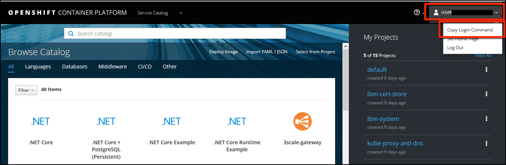

Before deploying the operator, you will need access to your Openshift Cluster, learn how to access the OpenShift web console and command-line interfaces (CLI).

**Note: Refer below instructions if your OpenShift Cluster is on IBM Cloud. If you have cluster on any other platform/cloud then refer login instructions from respective cloud/platform to get access to your cluster from terminal attached with this Lab.** 


**Access the OpenShift web console**

To begin, launch the OpenShift web console from the IBM Cloud portal.  

**Note:** the sample output shown in the lab guide may be slightly different from what you see in the output when you issue the commands for your cluster.

Login to IBM Cloud and Navigate to OpenShift Cluster Page
 -  Access your OpenShift lab cluster from the IBM Cloud portal: <a href="https://cloud.ibm.com/kubernetes/clusters?platformType=openshift" target="_blank">https://cloud.ibm.com/kubernetes/clusters?platformType=openshift</a>.

- Open the **OpenShift web console**.

**Note: the IBM Cloud Portal and  OpenShift web console will be opened in a new browser tabs.  You will need to switch between this tab and the new tabs to accomplish many of the lab tasks.  You may want to open the new tabs in new windows and display both browser windows at the same time. You may need to disable up blockers if you do not see the new tabs.**


- Once in the console, select your lab ID in the upper right, click. Scroll down and click **Copy Login Command**.



**Access your cluster using OpenShift command line interface**

- **Paste the login command** you copied from the Web UI into the lab terminal window. You can paste it using the right mouse and select paste from the menu or the paste keyboard shortcut for your operating system. The command will look similar to this:

```
oc login https​://console-openshift-console.mycluster-915b3b336cabeewrweffghdfaa7c625f-0000.us-south.containers.appdomain.cloud/dashboards --token=r0Nco6NU5Le3g......
```

You should see a success message similar to this:

```
Logged into "login https​://console-openshift-console.mycluster-915b3b336cabeewrweffghdfaa7c625f-0000.us-south.containers.appdomain.cloud/dashboards" as "IAM#openlabs" using the token provided.

You have access to the following projects and can switch between them with 'oc project <projectname>':

  * default
    ibm-cert-store
    ibm-system
    kube-proxy-and-dns
    kube-public
    kube-service-catalog
    kube-system
    openshift
    openshift-ansible-service-broker
    openshift-console
    openshift-infra
    openshift-monitoring
    openshift-node
    openshift-template-service-broker
    openshift-web-console

Using project "default".
Welcome! See 'oc help' to get started.
```

Once you login to your OpenShift Cluster, validate access to your cluster.

**Note: when you see commands in a black box with green text, you can execute these commands in the terminal window to the right several different ways:**

1. Manually type the command in the terminal window
2. Cut and paste from the instructions to the terminal window
3. Click on the green text and it will automatically be copied from the instructions window to the terminal window

- Execute the command below to view nodes in the cluster:

```execute
oc get node
```

Sample Output:


