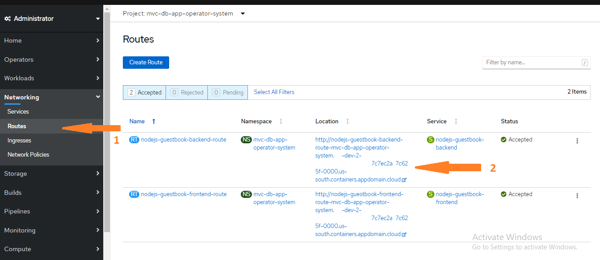
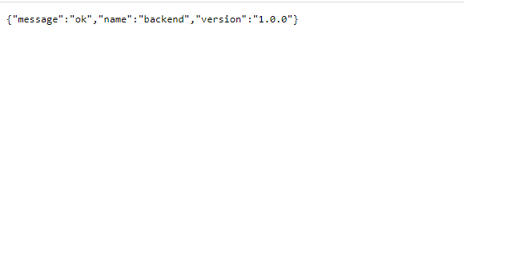
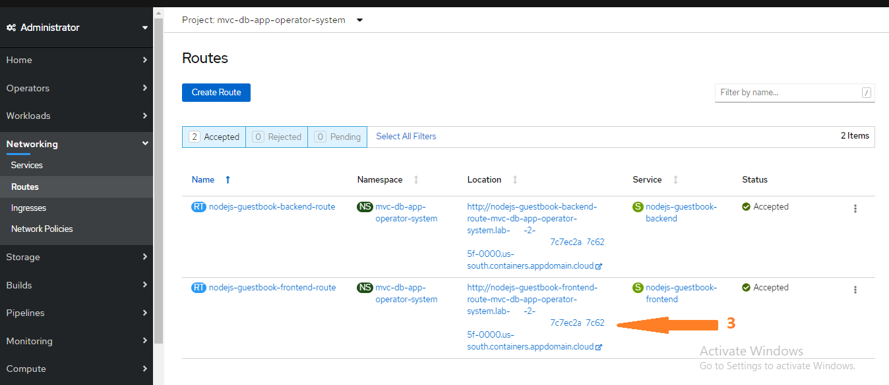
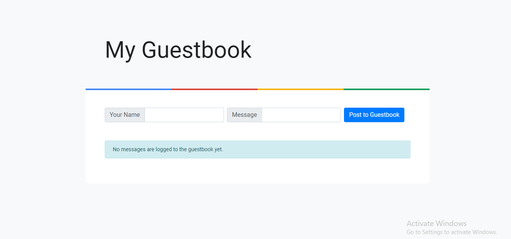
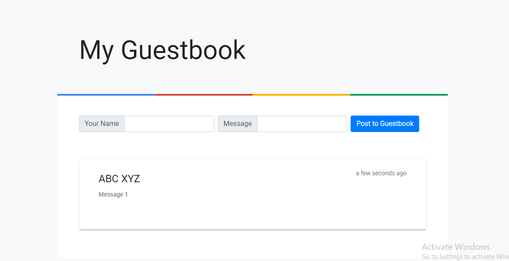

Now that you have all required resources created, it's time to access the Guestbook Application.
**Step 1**
Click on **Network** --> **Routes** to check all created routes.

**Step 2**
Click on `Location` of **nodejs-guestbook-backend-route** to access the Backend as shown below.

On click, you will be redirected to the backend route of the application as below.

**Step 3**
Click on `Location` of **nodejs-guestbook-frontend-route** to access the Frontend as shown below.

On click, you will be redirected to the frontend route of the application as below.

Now, you can put your name in `Your Name` and a message in `Message`, and clock on `Post to Guestbook`.

You will see all provided details being retained.

